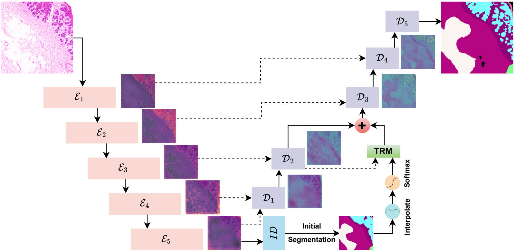

# Neural Tissue Relation Modeling (NTRM)

> **Can We Go Beyond Visual Features? Neural Tissue Relation Modeling for Relational Graph Analysis in Non-Melanoma Skin Histology**  
> *Shravan Venkatraman, Muthu Subash Kavitha, Joe Dhanith P R*  
> Medical Image Computing and Computer Assisted Intervention (MICCAI) Workshops (ISIC 2025)

#### [project page]() | [paper]()

A novel approach for histopathology image segmentation that explicitly models tissue-type relationships through graph-based reasoning.

## Overview

Neural Tissue Relation Modeling (NTRM) extends traditional CNN-based segmentation with a graph-based Tissue Relation Module (TRM) that captures spatial and functional relationships between different tissue types. NTRM builds a tissue-level graph representation where each node corresponds to a tissue class and edges represent contextual or spatial proximity. This explicit modeling of tissue relationships enables the network to leverage anatomical prior knowledge and improve segmentation accuracy, particularly at tissue boundaries.



## Tissue Relation Module

The key innovation in NTRM is the Tissue Relation Module (TRM) which constructs a tissue-level graph from segmentation predictions and refines them through message passing:


## Features

- 🧠 Explicit modeling of tissue-type relationships through graph neural networks
- 🔍 Improved boundary delineation between adjacent tissue types
- 📊 Comprehensive metrics tracking and visualization
- 🧪 Support for tissue-specific data augmentation strategies
- 📈 Dynamic class weighting to handle tissue class imbalance

The TRM consists of four main components:
1. **Region Proposal Network**: Extracts tissue-specific regions from initial segmentation
2. **Node Feature Extractor**: Computes embeddings for each tissue type
3. **Edge Feature Extractor**: Determines spatial relationships between tissues
4. **Graph Neural Network**: Refines tissue representations through message passing

## Installation

### Setup

1. Clone the repository:
```bash
git clone https://github.com/username/ntrm.git
cd ntrm
```

2. Create a virtual environment:
```bash
python -m venv venv
source venv/bin/activate  # On Windows: venv\Scripts\activate
```

3. Install dependencies:
```bash
pip install -r requirements.txt
```

## Dataset Preparation

NTRM is designed for histopathology image segmentation tasks. The repository includes scripts for processing whole slide images (WSIs) into suitable training patches.

### Data Structure

Organize your dataset with the following structure:
```
data/
  ├── Images/            # Original whole slide images
  ├── Masks/             # Corresponding segmentation masks
  └── Patches_512/       # (Will be created) 512×512 patches
      ├── image_001/
      │   ├── X/         # Image patches
      │   └── y/         # Mask patches
      └── ...
```

### Patch Generation

Generate training patches from whole slide images:

```bash
python preprocessing/create_patches.py --dir ./data/ --dim 512 --overlap
```

### Data Augmentation

Apply augmentation strategies for underrepresented tissue classes:

```bash
python preprocessing/augment_data.py --x_dir ./data/X_train --y_dir ./data/y_train --target_classes BCC SCC IEC FOL
```

## Training

Train the NTRM model with the following command:

```bash
python train.py --data_root ./data --batch_size 4 --epochs 150 --lr 1e-4 --hidden_dim 128 --gnn_layers 3
```

### Key Training Parameters

| Parameter | Description | Default |
|-----------|-------------|---------|
| `--data_root` | Root directory for data | `./data` |
| `--batch_size` | Batch size for training | `4` |
| `--epochs` | Number of epochs to train | `150` |
| `--lr` | Learning rate | `1e-4` |
| `--hidden_dim` | Hidden dimension for TRM | `128` |
| `--gnn_layers` | Number of GNN layers | `3` |
| `--patch_size` | Patch size | `512` |
| `--device` | Device to use | `cuda` |

## Evaluation

Evaluate the trained model on the test set:

```bash
python evaluate.py --checkpoint ./checkpoints/ntrm_best_model.pth --data_root ./data
```

## Repository Structure

```
|-- config.py                    # Global configuration settings
|-- evaluate.py                  # Model evaluation script
|-- models/                      # Model implementations
|   |-- base_models.py           # ResNet-UNet backbone
|   |-- complete_model.py        # Complete NTRM architecture
|   |-- tissue_relation.py       # Tissue Relation Module implementation
|-- preprocessing/               # Data preprocessing scripts
|   |-- augment_data.py          # Data augmentation for rare classes
|   |-- create_patches.py        # WSI patch extraction
|   |-- create_training_data_from_patches.py  # Dataset creation
|-- train.py                     # Training script
|-- utils/                       # Utility functions
|   |-- dataset.py               # Dataset and dataloader utilities
|   |-- metrics.py               # Evaluation metrics
|   |-- visualize.py             # Visualization utilities
```


<!-- ## Citation

If you find this code useful for your research, please consider citing our paper:

```bibtex
@inproceedings{ntrm2025,
  title={Neural Tissue Relation Modeling for Histopathology Image Segmentation},
  author={Author, A. and Author, B.},
  booktitle={Proceedings of the Conference},
  year={2025}
}
``` -->
